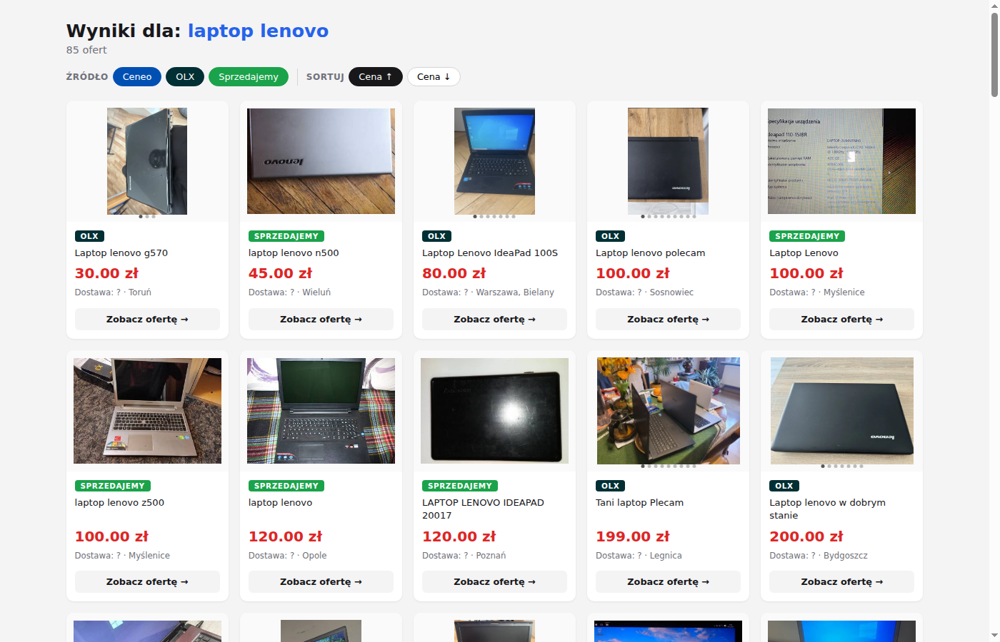

# Polish Price Aggregator

[](https://github.com/Helban/price-aggregator/actions/workflows/tests.yml)

Search for a product across multiple Polish marketplaces simultaneously and view results in a clean browser UI.

**Live sources:** Ceneo · OLX · Sprzedajemy.pl

## Demo

```
python main.py "laptop lenovo"
```

Opens a local HTML page with results sorted by price, filterable by source, with image carousels for OLX listings.



## Features

- Parallel async scraping — all sources fetched simultaneously with `asyncio.gather`
- Plugin architecture — each scraper is an independent class inheriting from `ScraperBase`
- Image carousel — OLX listings fetch detail pages in parallel to collect all photos
- Client-side filtering and sorting — toggle sources, sort by price asc/desc, live result count
- Fixture-based tests — parsers tested against real captured HTML, not mocked HTTP

## Stack

- **Python 3.14** · asyncio · httpx · BeautifulSoup · Jinja2
- **Playwright** (Allegro, when unblocked)
- **pytest** for parser and model tests

## Setup

```bash
git clone <repo>
cd price_aggregator

python -m venv .venv
source .venv/bin/activate
pip install -r requirements.txt  # or: pip install httpx playwright beautifulsoup4 lxml jinja2 python-dotenv

# Allegro API (optional — see Known Limitations below)
cp .env.example .env
# fill in ALLEGRO_CLIENT_ID and ALLEGRO_CLIENT_SECRET
```

## Usage

```bash
python main.py "iphone 15"
python main.py "hulajnoga elektryczna vsett"
```

## Running tests

```bash
pytest
```

HTML fixtures are committed to the repo so tests work offline out of the box.
When a scraper breaks due to a site layout change, refresh them with:

```bash
python tests/update_fixtures.py
```

## Architecture

```
main.py               # entry point: asyncio.gather → Jinja2 render → webbrowser.open
models.py             # Product dataclass — single shared model across all scrapers
scrapers/
  base.py             # ScraperBase ABC
  ceneo.py            # httpx + BeautifulSoup
  olx.py              # httpx + BeautifulSoup, parallel image enrichment
  sprzedajemy.py      # httpx + BeautifulSoup
  allegro.py          # Playwright (see Known Limitations)
templates/
  results.html        # Jinja2 + vanilla JS (filtering, sorting, carousel)
tests/
  fixtures/           # real HTML snapshots used by parser tests
  update_fixtures.py  # re-captures fixtures from live sites
```

Adding a new scraper: subclass `ScraperBase`, implement `search()`, add to the list in `main.py`.

## Security

- **XSS prevention** — Jinja2 renders results with `autoescape=True`; all scraped content (product names, URLs, seller names) is HTML-escaped before output
- **No secrets in code** — Allegro API credentials are loaded exclusively from `.env` via `python-dotenv`; `.env` is git-ignored
- **No data persistence** — results are written to a temp file (`/tmp/`) and never stored or transmitted
- **URL validation** — scraped URLs are rendered as links but escaped; `javascript:` protocol payloads are neutralised by autoescape

## Known Limitations

**Allegro** is protected by [DataDome](https://datadome.co/) bot detection.
The following approaches were tried and blocked: Playwright Chromium/Firefox headless,
Camoufox, Patchright, nodriver. The official REST API (`/offers/listing`) requires verified application status,
but Allegro announced (via their API GitHub) that they no longer review or approve
new applications — this is a permanent business decision.
Workaround: paid captcha-solving service (e.g. CapSolver).
