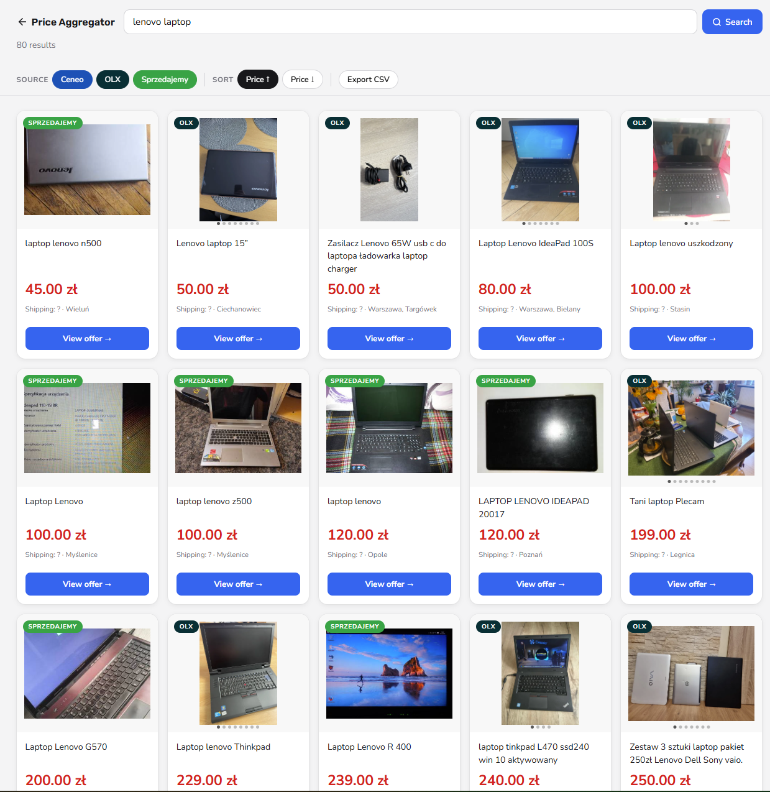
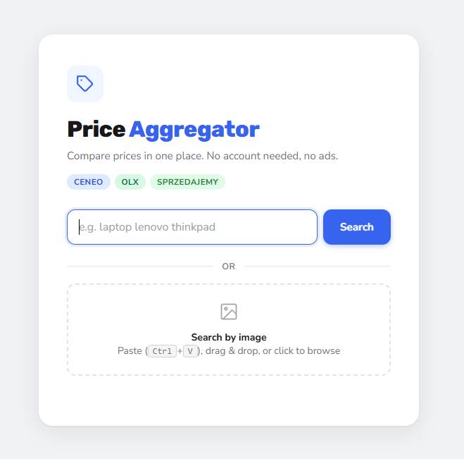

# Polish Price Aggregator

[](https://github.com/Helban/price-aggregator/actions/workflows/tests.yml)

Search for a product across multiple Polish marketplaces simultaneously and view results in a browser UI.

**Live sources:** Ceneo · OLX · Sprzedajemy.pl

## Demo

Web UI (search by text **or by image**):

```
uvicorn app:app --reload
# open http://127.0.0.1:8000
```

Or the original CLI:

```
python main.py "laptop lenovo"
```

Both open a results page sorted by price, filterable by source, with image carousels for OLX listings.

**Search results** (80 listings from 3 sources, sorted by price):



**Landing page** (search by text or image):



## Features

- **Search by image:** paste a screenshot (Ctrl+V) or drop a file. Google Vision turns it into a search query, since none of these marketplaces have native reverse-image search.
- **Parallel async scraping:** all sources fetched simultaneously with `asyncio.gather`.
- **Plugin architecture:** each scraper is an independent class inheriting from `ScraperBase`.
- **Image carousel:** OLX listings fetch detail pages in parallel to collect all photos.
- **Client-side filtering and sorting:** toggle sources, sort by price asc/desc, live result count.
- **Fixture-based tests:** parsers run against real captured HTML, not mocked HTTP.

## Stack

- **Python 3.14** · asyncio · httpx · BeautifulSoup · Jinja2
- **FastAPI** + Uvicorn for the web UI
- **Google Cloud Vision** (WEB_DETECTION via REST) for image-to-query
- **Playwright** (Allegro, when unblocked)
- **pytest** for parser, model, image-search and endpoint tests

## Setup

```bash
git clone <repo>
cd price_aggregator

python -m venv .venv
source .venv/bin/activate
pip install -r requirements.txt  # or: pip install httpx playwright beautifulsoup4 lxml jinja2 python-dotenv

cp .env.example .env
# Allegro API (optional, see Known Limitations): ALLEGRO_CLIENT_ID / ALLEGRO_CLIENT_SECRET
# Image search (optional): GOOGLE_VISION_API_KEY
```

### Google Vision API key (for image search)

Image search needs a `GOOGLE_VISION_API_KEY` in `.env`. Text search works without it.

1. [console.cloud.google.com](https://console.cloud.google.com) → create a project
2. Enable **Cloud Vision API**
3. **Credentials** → create an **API key** (restrict it to the Vision API)
4. Enable **billing** on the project

> Billing must be enabled even for the free tier. The first 1,000 images/month (web detection) are free.

## Usage

Web UI (text or image search):

```bash
uvicorn app:app --reload          # http://127.0.0.1:8000
```

CLI:

```bash
python main.py "iphone 15"
python main.py "hulajnoga elektryczna vsett"
python main.py "iphone 15" --export   # also writes an .xlsx file
```

## Running tests

```bash
pytest
```

HTML fixtures are committed to the repo so tests work offline out of the box.
When a scraper breaks due to a site layout change, refresh them with:

```bash
python tests/update_fixtures.py
```

## Architecture

```
app.py                # FastAPI web UI: GET / , GET /search , POST /resolve-image
main.py               # CLI entry point: search -> Jinja2 render -> webbrowser.open
search_service.py     # shared pipeline: search_all, render_results, export_to_excel
image_search.py       # image -> query via Google Vision WEB_DETECTION + DOCUMENT_TEXT_DETECTION
models.py             # Product dataclass, shared across all scrapers
scrapers/
  base.py             # ScraperBase ABC
  ceneo.py            # httpx + BeautifulSoup
  olx.py              # httpx + BeautifulSoup, parallel image enrichment
  sprzedajemy.py      # httpx + BeautifulSoup
  allegro.py          # Playwright (see Known Limitations)
templates/
  index.html          # landing: search box + image paste/drop zone
  results.html        # Jinja2 + vanilla JS (filtering, sorting, carousel)
tests/
  fixtures/           # real HTML snapshots used by parser tests
  update_fixtures.py  # re-captures fixtures from live sites
```

`main.py` (CLI) and `app.py` (web) both call into `search_service.py`, one pipeline, two front-ends.
Image search is a *query resolver*: `image_search.py` turns an image into text, then the normal
text-search path runs. The scrapers never see an image.

Adding a new scraper: subclass `ScraperBase`, implement `search()`, add to the list in `search_service.py`.

## Security

- **XSS prevention:** Jinja2 renders results with `autoescape=True`, so all scraped content (product names, URLs, seller names) is HTML-escaped before output.
- **No secrets in code:** Allegro credentials load from `.env` via `python-dotenv`. The file is git-ignored.
- **No data persistence:** results go to a temp file in `/tmp/` and are never stored or transmitted.
- **Image upload hardening:** `/resolve-image` rejects non-image content types and caps uploads at 10 MB. The Vision API key never leaves the server.
- **URL validation:** scraped URLs are escaped by autoescape, which blocks `javascript:` protocol payloads.

## How image search works

None of the supported marketplaces have a native reverse-image search endpoint (verified by inspecting their JS and network traffic). The image is used only as a *query resolver*: Google Vision analyses it and returns a product name, which is then fed into the normal text-search pipeline. The scrapers never receive an image.

Two Vision features run in a single request:

- **`DOCUMENT_TEXT_DETECTION`** reads text directly off the image. Good for book covers, packaging, screenshots with visible product names.
- **`WEB_DETECTION`** matches the image against Google's index and returns a best-guess label. Good for branded electronics and widely-photographed products.

The picker tries the text result first (if it looks like a short product name, 2-6 words), then falls back to the web-detection guess. Neither is perfect: Vision often returns English or overly generic labels ("motorized scooter", "display device"). That's why the detected phrase goes into the search box for the user to confirm before submitting. A wrong query means waiting 5-8 seconds for useless results.

## Known Limitations

**Allegro** is protected by [DataDome](https://datadome.co/) bot detection.
The following approaches were tried and blocked: Playwright Chromium/Firefox headless,
Camoufox, Patchright, nodriver. The official REST API (`/offers/listing`) requires verified application status,
but Allegro announced (via their API GitHub) that they no longer review or approve
new applications. That's a permanent business decision on their end.
Workaround: paid captcha-solving service (e.g. CapSolver).
